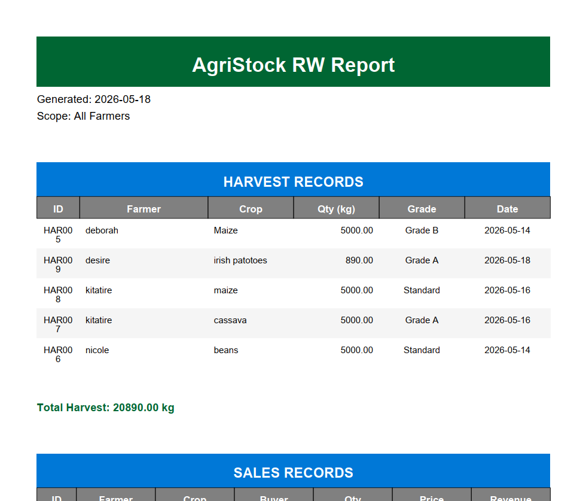
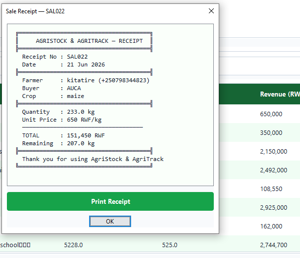

# 🌾 AgriStock & AgriTrack - Agricultural Stock Management System


> A distributed Java-based agricultural stock management system for Rwandan cooperatives. Built with Java 26, Hibernate ORM, RMI, and modern Swing UI.

## ✨ Features

- 🔐 **OTP Authentication** - Secure login via email OTP (5-minute expiry)
- 👥 **Role-Based Access** - ADMIN approves users; OFFICER manages data
- 👨‍🌾 **Farmer Management** - CRUD operations with Rwandan phone validation (+2507XXXXXXXX)
- 🌾 **Harvest Logging** - Record crop yields with quality grading (Grade A/B/Standard)
- 💰 **Sales Management** - Track sales with **automatic stock validation** (no overselling!)
- 📊 **Reporting** - Export harvest/sales data to CSV & generate professional PDF reports
- 📧 **Email Notifications** - Brevo SMTP for OTP, approvals, alerts
- 🔔 **ActiveMQ Integration** - Async event notifications (optional)
- 🎨 **Modern UI** - Custom Swing theme with gradients, rounded corners, responsive layouts

## 📸 Screenshots

### Login Page


### Main Dashboard


### Farmer Management Interface


### Reports & Receipts
| Reports | Receipt |
|---------|---------|
|  |  |

## 🏗️ Architecture

```
┌─────────────────┐      RMI (Port 5000)      ┌─────────────────┐
│   CLIENT SIDE   │◄────────────────────────►│   SERVER SIDE   │
│   (Java Swing)  │                           │  (Business Logic)│
└─────────────────┘                           └────────┬────────┘
                                                       │
                                                       │ JDBC
                                                       ▼
                                              ┌─────────────────┐
                                              │   PostgreSQL    │
                                              │  (agristock_rw_db)│
                                              └─────────────────┘
```

### Tech Stack
| Layer | Technology |
|-------|-----------|
| **Language** | Java 26 |
| **ORM** | Hibernate 8.0.0.Alpha1 |
| **Database** | PostgreSQL 16+ |
| **Communication** | Java RMI (Remote Method Invocation) |
| **UI** | Java Swing + Custom UITheme |
| **Messaging** | ActiveMQ 6.1.2 (JMS) |
| **Email** | Brevo SMTP (JavaMail) |
| **Reporting** | OpenPDF 2.0.2, Apache Commons CSV |
| **Build** | Maven 3.8+ |

## 🚀 Quick Start

### Prerequisites
- ✅ Java 26 or later ([Download](https://jdk.java.net/))
- ✅ PostgreSQL 16+ ([Download](https://www.postgresql.org/download/))
- ✅ Maven 3.8+ ([Download](https://maven.apache.org/download.cgi))
- ✅ ActiveMQ 6.1.2 (optional, for notifications) ([Download](https://activemq.apache.org/))

### Step 1: Database Setup
```sql
-- Run in PostgreSQL (psql or pgAdmin):
CREATE DATABASE agristock_rw_db;
CREATE USER agristock_user WITH PASSWORD 'your_secure_password';
GRANT ALL PRIVILEGES ON DATABASE agristock_rw_db TO agristock_user;
```

### Step 2: Configure Database Connection
Edit `AgriStockServer26478/src/main/resources/hibernate.cfg.xml`:
```xml
<property name="hibernate.connection.url">jdbc:postgresql://localhost:5432/agristock_rw_db</property>
<property name="hibernate.connection.username">agristock_user</property>
<property name="hibernate.connection.password">your_secure_password</property>
```

### Step 3: Configure Email (Optional but Recommended)
Edit `AgriStockServer26478/src/main/java/com/wastonix/notification/EmailService.java`:
```java
private static final String SMTP_LOGIN = "your_brevo_login";
private static final String SMTP_KEY = "your_brevo_api_key";
```

### Step 5: Build the Project
```bash
# Build server
cd server
mvn clean install

# Build client (in new terminal)
cd ../client
mvn clean install
```

### Step 6: Run the Server
```bash
cd server
java -cp target/AgriStockRWServer-1.0-SNAPSHOT.jar com.wastonix.server.RmiServerBootstrap
```
✅ Wait for: `✅ AgriStockService bound and ready.`

### Step 7: Run the Client
```bash
cd client
java -cp target/AgriStockRWClient-1.0-SNAPSHOT.jar com.wastonix.client.auth.LoginFrame
```
✅ Login window opens!

### Step 8: First Login (Admin)
1. Click **Register** tab
2. Enter:
    - Name: Your full name (e.g. Administrator)
    - Email: your-email@example.com (use your own email)
    - Phone: +2507XXXXXXXX (Rwandan format)
 3. Submit → Wait for approval (development builds may auto-approve; check server logs or `RmiServerBootstrap.java`)
 4. Switch to **Login** tab
 5. Enter your email → Click **Send OTP** → Check your email (or application console in local/dev) for the OTP code
 6. Enter OTP → Click **Verify & Sign In**
 7. 🎉 Dashboard opens with ADMIN privileges (once the account is approved)

## 🔧 Configuration Reference

### Database (`hibernate.cfg.xml`)
| Property | Example Value | Description |
|----------|---------------|-------------|
| `hibernate.connection.url` | `jdbc:postgresql://localhost:5432/agristock_rw_db` | PostgreSQL connection URL |
| `hibernate.connection.username` | `agristock_user` | Database username (create a dedicated user) |
| `hibernate.connection.password` | `<YOUR_DB_PASSWORD>` | Database password — DO NOT store real passwords in public files |
| `hibernate.hbm2ddl.auto` | `update` | Auto-create/update tables (use with caution) |

Security note: Do not commit real credentials. Use environment variables or a local, non-committed properties file to store sensitive values (for example, set `DB_PASSWORD` in your environment and load it at runtime).

### RMI Settings
| File | Setting | Default |
|------|---------|---------|
| `RmiServerBootstrap.java` | Registry port | `5000` |
| `RmiClientUtil.java` | RMI URL | `//localhost:5000/AgriStockService` |

### Email (Brevo SMTP)
| File | Setting | Description |
|------|---------|-------------|
| `EmailService.java` | `SMTP_HOST` | `smtp-relay.brevo.com` |
| `EmailService.java` | `SMTP_PORT` | `587` |
| `EmailService.java` | `SMTP_LOGIN` | `<YOUR_SMTP_LOGIN>` |
| `EmailService.java` | `SMTP_PASSWORD` | `<YOUR_SMTP_PASSWORD>` (set via environment variable; do not commit) |

Tip: Configure your SMTP credentials via environment variables or a secure secrets store. Avoid embedding account passwords or real email addresses in the README or source.
| `EmailService.java` | `SMTP_KEY` | Your Brevo API key |

## 🧪 Testing

### Run Unit Tests
```bash
cd server
mvn test
```

### Manual Test Flow
1. Register new user → Check admin approval workflow
2. Login with OTP → Verify role-based UI
3. Add farmer → Log harvest → Record sale → Verify stock validation
4. Generate PDF report → Verify formatting and data accuracy

## 🐛 Troubleshooting

### "Connection refused: getsockopt" (ActiveMQ)
```
⚠️ ActiveMQ Error: Could not connect to broker URL: tcp://localhost:61616
```
✅ **This is NORMAL if ActiveMQ isn't running.** Core functionality works without it. To fix:
1. Install ActiveMQ: https://activemq.apache.org/
2. Start broker: `./bin/activemq start`
3. Or ignore - notifications will log to console instead

### "Cannot resolve symbol" in IntelliJ
1. Right-click `pom.xml` → **Maven** → **Reload Project**
2. **Build** → **Rebuild Project**
3. **File** → **Invalidate Caches** → **Invalidate and Restart**

### RMI Connection Failed
```
❌ RMI Connection failed: Connection refused to host: localhost
```
✅ Ensure:
1. Server is running FIRST (`RmiServerBootstrap`)
2. Port 5000 is not blocked by firewall
3. Client uses same `RMI_URL` as server binding

### PDF Generation Error
✅ Ensure `document.close()` is called BEFORE getting byte array (fixed in `ReportGenerator.java`)

## 📄 License
This project is licensed under the MIT License - see the [LICENSE](LICENSE) file for details.

## 👨‍💻 Author
**Waston Christian (Leon Christian Abumukiza)**
- 📍 Kigali, Rwanda
- 🎓 Information Management Student
- 💻 Java Developer | Distributed Systems | Hibernate & RMI Expert
 - 📧 Use your own contact email (do not publish personal emails in public repos)
- 🔗 [GitHub](https://github.com/Leon-christian-00) | [LinkedIn](https://linkedin.com/in/yourprofile)

## 🙏 Acknowledgments
- Rwanda Agricultural Cooperatives for requirements gathering
- Hibernate community for ORM support
- OpenPDF & Apache Commons for reporting libraries
- Brevo for transactional email services

---
> *"Empowering Rwandan farmers through technology."* 

---